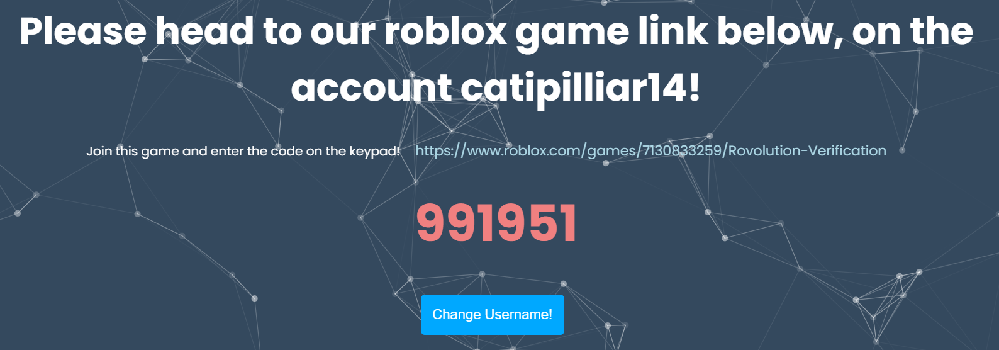
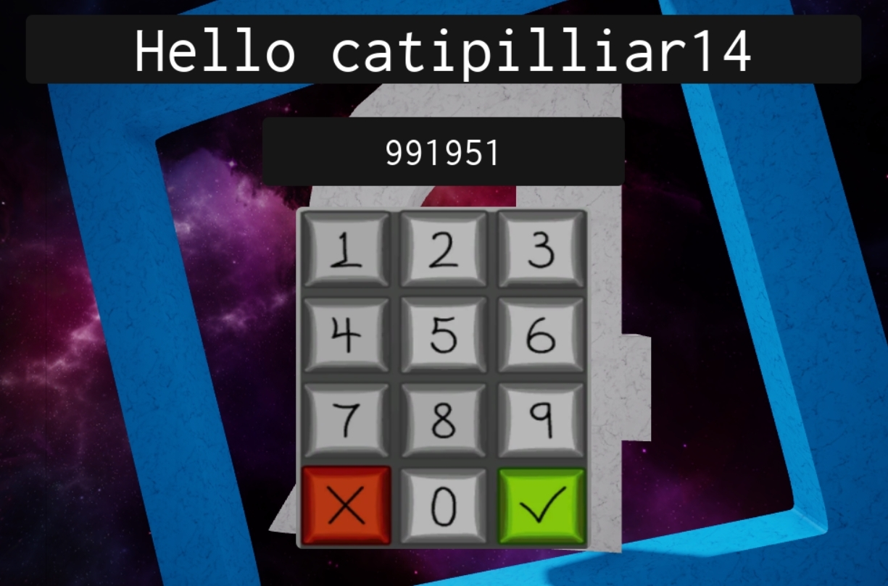

# Verification Support

### Verifying for the first time

If you are a new user to Rovolution we welcome you and hope you have a flawless experience with us. To link your account to the bot visit this [link](https://www.rovolution.me/verify), log in using Discord. Once you do this you will be directed to a page which will give you two options, we recommend you click 'Verify by Joining a game'.

This will then ask you to input your Roblox username into a box, you will have to start typing your username before it will give you the option to select yourself. For this example I will be using my username.&#x20;



After selecting your username you will need to click 'Verify with the username (your username)'. You will then be given a code and a link to a [game](https://www.roblox.com/games/7130833259/Rovolution-Verification). You will need to join this [game](https://www.roblox.com/games/7130833259/Rovolution-Verification) and then click 'Get Verified!'. You will then be asked to input the code given to you on the website in order to verify that you own the account.&#x20;

Once you have entered the code click the Green tick on the right hand side - this will then verify your code before linking your account. If all goes well you will now be a verified user of Rovolution and you will be able to use our services to their fullest.&#x20;


If you had any issues with verifying feel free to join our [support server](https://discord.com/invite/2bMg4evVWz) and send a 'Verification Support Ticket' to be put into contact with a member of our Customer Service team.&#x20;



If you wish to reverify under another Roblox account you will need to repeat the steps above. However if you wish to remove your account from Rovolution you will need to join our [support server](https://discord.com/invite/2bMg4evVWz)  and create a Support Ticket to request a data deletion.

